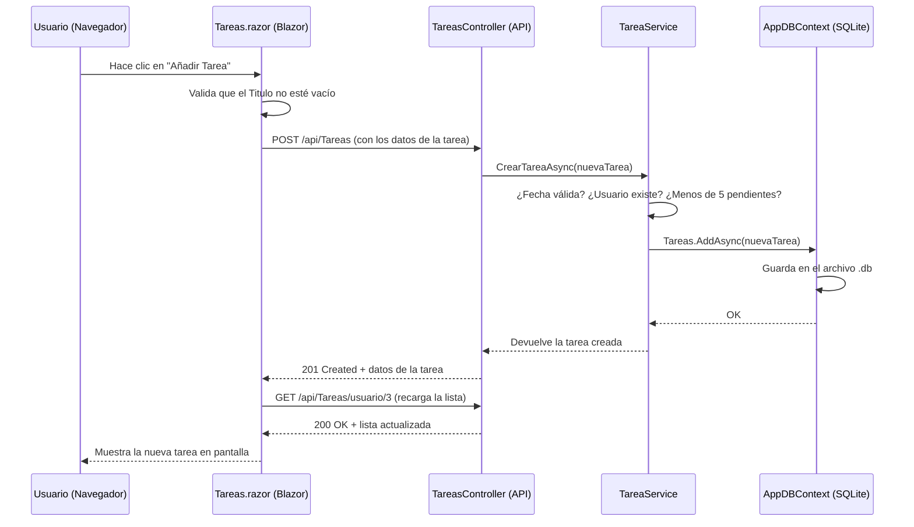

# 📚 Guía Teórica: Proyecto TaskManager (ABM)

> Este documento es tu compañero de estudio para el proyecto de Gestión de Tareas. Está pensado para perfiles **Trainee/Junior** que quieren entender **por qué** se hace cada cosa, no solo el "cómo". Leelo con calma, con el código abierto al lado.

---

## 🗺️ Índice

1. [¿Qué es este proyecto?](#1-qué-es-este-proyecto)
2. [Arquitectura por Capas](#2-arquitectura-por-capas)
3. [Capa de Modelos](#3-a-capa-de-modelos-modelos)
4. [Capa de Base de Datos](#4-b-capa-de-acceso-a-datos-db)
5. [Capa de Servicios](#5-c-capa-de-servicios-services---la-más-importante)
6. [Capa de Controladores](#6-d-capa-de-controladores-controllers)
7. [Punto de Entrada](#7-e-el-punto-de-entrada-programcs)
8. [Capa de Frontend (Blazor)](#8-capa-de-frontend-blazor-server)
9. [Conceptos Clave para la Entrevista](#9-conceptos-clave-para-la-entrevista)
10. [Flujo Completo de Datos](#10-flujo-completo-de-datos)
11. [Tabla Resumen de Endpoints (API)](#11-tabla-resumen-de-endpoints-api)

---

## 1. ¿Qué es este proyecto?

Es un sistema **ABM** (Alta, Baja y Modificación) — en inglés se llama **CRUD** (Create, Read, Update, Delete). Permite gestionar Usuarios y sus Tareas a través de una interfaz web.

La tecnología usada es **ASP.NET Core con Blazor**, todo en C#. La base de datos es **SQLite**, un archivo `.db` que vive dentro del propio proyecto (ideal para practicar sin instalar nada extra).

---

## 2. Arquitectura por Capas

El proyecto está dividido en "capas". Pensalo como una empresa con distintos departamentos: cada uno tiene su responsabilidad y no se mete con el trabajo del otro.

```
📁 TaskManagerProject/
│
├── 📁 Modelos/        → "Los planos" — qué son las cosas (Usuario, Tarea)
├── 📁 DB/             → "La bodega" — cómo se conecta con la base de datos
├── 📁 Services/       → "El cerebro" — las reglas de negocio
├── 📁 Controllers/    → "La recepción" — atiende las peticiones de afuera (API)
├── 📁 Pages/          → "La vidriera" — lo que ve el usuario en el navegador
├── 📁 Layout/         → "El marco" — la estructura visual compartida
│
├── App.razor          → El "HTML raíz" de toda la aplicación
├── Routes.razor       → El "GPS" que decide qué página mostrar
├── _Imports.razor     → La "mochila global" con imports compartidos
└── Program.cs         → El "interruptor general" — arranca todo
```

> **Regla de oro:** Cada capa solo habla con la capa inmediatamente debajo. La página (Blazor) → llama al API (Controller) → llama al Service → llama a la base de datos (DB Context). Nunca una página accede directamente a la base de datos.

---

## 3. A. Capa de Modelos (`Modelos/`)

Aquí definimos **qué datos** maneja nuestra aplicación. Son simples clases de C# que representan objetos del mundo real.

### `Usuario.cs`

```csharp
public class Usuario
{
    public int Id { get; set; }
    public string Nombre { get; set; }
    public string Email { get; set; }
    public bool Activo { get; set; } = true;

    // Relación: un Usuario TIENE MUCHAS Tareas
    public List<Tarea> Tareas { get; set; } = new List<Tarea>();
}
```

**¿Qué es `{ get; set; }`?**  
Es una **propiedad** en C#. Es la forma de exponer los datos de una clase de manera controlada. Es como tener una caja con una ranura para meter datos y otra para sacarlos.

**¿Qué es `= true` o `= new List<Tarea>()`?**  
Son **valores por defecto**. Cuando creás un `new Usuario()`, automáticamente `Activo` es `true` y `Tareas` es una lista vacía, sin que tengas que escribirlo vos.

---

### `Tarea.cs`

```csharp
public class Tarea
{
    public int Id { get; set; }
    public string Titulo { get; set; }
    public string Descripcion { get; set; }
    public DateTime FechaCreacion { get; set; }
    public DateTime FechaVencimiento { get; set; }
    public bool Completada { get; set; }
    public DateTime? FechaFinalizacion { get; set; }  // ← El ? es importante

    // Relación: esta Tarea PERTENECE A un Usuario
    public int UsuarioId { get; set; }
    public Usuario Usuario { get; set; }
}
```

**¿Qué significa `DateTime?` (con el signo de pregunta)?**  
El `?` significa que el valor puede ser `null` (vacío). `FechaFinalizacion` no tiene valor hasta que la tarea se completa. Si no tuviera el `?`, el programa fallaría al intentar guardar una tarea sin fecha de finalización.

### 🔗 Relación entre modelos (uno a muchos)

```
Usuario 1 ──────────── ∞ Tarea
(uno)                  (muchos)
```

Un `Usuario` puede tener muchas `Tarea`s. Una `Tarea` pertenece a un solo `Usuario` (a través de `UsuarioId`).

---

## 4. B. Capa de Acceso a Datos (`DB/`)

### `AppDBContext.cs`

```csharp
public class AppDBContext : DbContext
{
    public AppDBContext(DbContextOptions<AppDBContext> options)
        : base(options) { }

    // Estas son las "tablas" de la base de datos
    public DbSet<Usuario> Usuarios { get; set; }
    public DbSet<Tarea> Tareas { get; set; }

    protected override void OnModelCreating(ModelBuilder modelBuilder)
    {
        // Configuramos la relación: Tarea tiene un Usuario, 
        // Usuario tiene muchas Tareas.
        // OnDelete Cascade: si se elimina el Usuario, se eliminan sus Tareas
        modelBuilder.Entity<Tarea>()
            .HasOne(t => t.Usuario)
            .WithMany(u => u.Tareas)
            .HasForeignKey(t => t.UsuarioId)
            .OnDelete(DeleteBehavior.Cascade);
    }
}
```

**¿Qué es Entity Framework Core (EF Core)?**  
Es un **ORM** (Object-Relational Mapper). Traduce tus clases C# en tablas de base de datos y tus consultas C# en SQL. En vez de escribir `SELECT * FROM Usuarios`, escribís `_context.Usuarios.ToListAsync()`.

**¿Qué es `DbSet<T>`?**  
Es como una representación de una tabla. `DbSet<Usuario>` = la tabla `Usuarios` en la base de datos.

**¿Qué es `OnDelete(DeleteBehavior.Cascade)`?**  
Si eliminás un Usuario, automáticamente se eliminan todas sus Tareas. Esto se llama **eliminación en cascada**. Sin esto, la base de datos rechazaría borrar un usuario que tenga tareas.

---

## 5. C. Capa de Servicios (`Services/`) — ¡La más importante!

Aquí vive la **lógica de negocio**. Esta capa toma decisiones. No le importa cómo llegaron los datos ni quién los pidió, solo aplica las reglas.

### `UsuarioService.cs`

Veamos el método más interesante: `EliminarUsuarioAsync`.

```csharp
public async Task EliminarUsuarioAsync(int idUsuario)
{
    // 1. Buscar el usuario Y cargar sus tareas al mismo tiempo
    var usuario = await _context.Usuarios
        .Include(u => u.Tareas)       // ← Carga las tareas relacionadas
        .FirstOrDefaultAsync(u => u.Id == idUsuario);

    // 2. Regla: ¿existe?
    if (usuario == null)
        throw new Exception("Usuario no encontrado");

    // 3. Regla de negocio: no se puede borrar si tiene tareas activas
    var tieneTareasActivas = usuario.Tareas.Any(t => !t.Completada);
    if (tieneTareasActivas)
        throw new Exception("No se puede eliminar el usuario, tiene tareas activas");

    // 4. Si pasó todas las reglas, recién ahora se elimina
    _context.Usuarios.Remove(usuario);
    await _context.SaveChangesAsync();
}
```

**¿Qué es `.Include()`?**  
Le dice a EF Core que cuando traiga el `Usuario`, también traiga sus `Tareas`. Sin esto, `usuario.Tareas` estaría vacío aunque en la base de datos hubiera tareas.

**¿Qué es `.Any()`?**  
Es un método de LINQ (una forma de consultar listas en C#). `usuario.Tareas.Any(t => !t.Completada)` se lee: "¿Hay alguna tarea cuya propiedad `Completada` sea falsa?". Devuelve `true` o `false`.

---

### `TareaService.cs`

Veamos `CrearTareaAsync`, que tiene 3 reglas de negocio:

```csharp
public async Task<Tarea> CrearTareaAsync(Tarea nuevaTarea)
{
    // REGLA 1: La fecha de vencimiento no puede ser en el pasado
    if (nuevaTarea.FechaVencimiento < DateTime.Now)
        throw new Exception("No se puede crear una tarea con fecha en el pasado.");

    // REGLA 2: El usuario debe existir
    var usuario = await _context.Usuarios
        .Include(u => u.Tareas)
        .FirstOrDefaultAsync(u => u.Id == nuevaTarea.UsuarioId);

    if (usuario == null)
        throw new Exception("El usuario especificado no existe.");

    // REGLA 3: No más de 5 tareas pendientes por usuario
    var tareasPendientes = usuario.Tareas.Count(t => !t.Completada);
    if (tareasPendientes >= 5)
        throw new Exception("El usuario ya tiene 5 tareas pendientes.");

    // Si todo está ok, se rellenan campos automáticos y se guarda
    nuevaTarea.FechaCreacion = DateTime.Now;
    nuevaTarea.Completada = false;
    nuevaTarea.FechaFinalizacion = null;

    await _context.Tareas.AddAsync(nuevaTarea);
    await _context.SaveChangesAsync();

    return nuevaTarea;
}
```

**¿Por qué tiramos Excepciones (`throw new Exception`)?**  
Porque si algo sale mal en la lógica, queremos "gritar" el error para que quien llamó a este método (el Controller) pueda capturarlo y devolver un mensaje útil al usuario.

---

## 6. D. Capa de Controladores (`Controllers/`)

Es la **puerta de entrada** de la API. Recibe peticiones HTTP del exterior y las delega al Service. No tiene lógica de negocio, solo maneja la comunicación.

### `UsuariosController.cs`

```csharp
[ApiController]
[Route("api/[controller]")]  // La URL base será: /api/Usuarios
public class UsuariosController : ControllerBase
{
    private readonly UsuarioService _usuarioService;

    // Inyección de dependencias: el Service se "inyecta" por constructor
    public UsuariosController(UsuarioService usuarioService)
    {
        _usuarioService = usuarioService;
    }

    [HttpGet]               // GET /api/Usuarios → devuelve todos
    [HttpGet("{id}")]       // GET /api/Usuarios/5 → devuelve uno
    [HttpPost]              // POST /api/Usuarios → crea uno
    [HttpPut("{id}")]       // PUT /api/Usuarios/5 → edita uno
    [HttpDelete("{id}")]    // DELETE /api/Usuarios/5 → elimina uno
}
```

### ¿Cómo maneja los errores el Controller?

```csharp
[HttpDelete("{id}")]
public async Task<IActionResult> Delete(int id)
{
    try
    {
        await _usuarioService.EliminarUsuarioAsync(id);
        return NoContent();        // 204: todo bien, no hay nada que devolver
    }
    catch (Exception ex)
    {
        return BadRequest(ex.Message); // 400: algo estuvo mal, devolvemos el mensaje
    }
}
```

El `try-catch` es como una red de seguridad. Si el Service "grita" una excepción, el Controller la "atrapa" y la convierte en una respuesta HTTP entendible.

### `TareasController.cs` — El método especial: `PATCH`

```csharp
// PATCH /api/Tareas/5/completar
[HttpPatch("{id}/completar")]
public async Task<ActionResult<Tarea>> Completar(int id)
{
    try
    {
        var tarea = await _tareaService.CompletarTareaAsync(id);
        return Ok(tarea);
    }
    catch (Exception ex)
    {
        return BadRequest(ex.Message);
    }
}
```

**¿Por qué `PATCH` y no `PUT`?**  
`PUT` reemplaza un objeto completo. `PATCH` modifica solo una parte de él. Completar una tarea no cambia su título ni descripción, solo su estado de `Completada` y su `FechaFinalizacion`. Por eso usamos `PATCH`.

---

## 7. E. El Punto de Entrada (`Program.cs`)

Es el primer archivo que se ejecuta cuando arranca la aplicación. Tiene dos responsabilidades principales:

### Parte 1: Registrar los servicios (el "armario de herramientas")

```csharp
var builder = WebApplication.CreateBuilder(args);

// Decirle a la app que tiene Controllers de API
builder.Services.AddControllers();

// Decirle que tiene componentes Blazor con modo interactivo
builder.Services.AddRazorComponents()
    .AddInteractiveServerComponents();

// Registrar el HttpClient para que los componentes Blazor puedan llamar a la API
builder.Services.AddScoped(sp =>
    new HttpClient { BaseAddress = new Uri("https://localhost:7214") });

// Configurar SQLite como base de datos
builder.Services.AddDbContext<AppDBContext>(options =>
    options.UseSqlite(builder.Configuration.GetConnectionString("SQLiteConnection")));

// Registrar nuestros servicios para que la Inyección de Dependencias los conozca
builder.Services.AddScoped<UsuarioService>();
builder.Services.AddScoped<TareaService>();
```

**¿Qué significa `AddScoped`?**  
Define el **ciclo de vida** del servicio. `Scoped` significa que se crea una nueva instancia por cada petición HTTP. Las otras opciones son:
- `AddSingleton`: Una sola instancia para toda la vida de la app.
- `AddTransient`: Una nueva instancia cada vez que se pide, incluso dentro de la misma petición.

### Parte 2: Configurar el pipeline HTTP (el "camino" de las peticiones)

```csharp
var app = builder.Build();

if (app.Environment.IsDevelopment())
{
    // Habilitar Swagger (la interfaz de prueba de la API)
    app.UseSwagger();
    app.UseSwaggerUI();

    // Crear la base de datos si no existe (¡muy útil para practicar!)
    using (var scope = app.Services.CreateScope())
    {
        var db = scope.ServiceProvider.GetRequiredService<AppDBContext>();
        db.Database.EnsureCreated(); // Crea el archivo .db si no existe
    }
}

app.UseHttpsRedirection(); // Redirige HTTP a HTTPS
app.UseStaticFiles();      // Permite servir archivos estáticos (CSS, JS, imágenes)
app.UseAntiforgery();      // Protección contra ataques CSRF

app.MapControllers();      // Activa las rutas de la API (Controllers)
app.MapRazorComponents<App>()
    .AddInteractiveServerRenderMode(); // Activa las páginas Blazor

app.Run(); // ¡Arranca el servidor!
```

---

## 8. Capa de Frontend (Blazor Server)

Aquí el usuario ve e interactúa con la aplicación. En Blazor, las "páginas" son componentes `.razor` que mezclan HTML con C#.

### Archivos de infraestructura visual

#### `App.razor` — El HTML raíz
Es el "esqueleto" HTML de toda la app. Solo existe uno. Incluye el CSS de Bootstrap, los íconos y el script de Blazor.

```html
<body>
    <Routes @rendermode="InteractiveServer" />
    <script src="_framework/blazor.web.js"></script>
</body>
```

Ese `blazor.web.js` es el motor que hace que Blazor funcione en el navegador, manteniendo una conexión en tiempo real con el servidor (via SignalR/WebSockets).

---

#### `Routes.razor` — El GPS
Decide qué componente de página mostrar según la URL del navegador.

```razor
<Router AppAssembly="@typeof(Program).Assembly">
    <Found Context="routeData">
        <RouteView RouteData="@routeData" DefaultLayout="@typeof(Layout.MainLayout)" />
        <FocusOnNavigate RouteData="@routeData" Selector="h1" />
    </Found>
</Router>
```

Lee todos los componentes del proyecto que tengan `@page "/ruta"` y los mapea. `DefaultLayout` define qué "marco" visual usar para todas las páginas.

---

#### `_Imports.razor` — La mochila global
Todos los `@using` que escribas acá se aplican automáticamente a **todos** los archivos `.razor` del proyecto.

```razor
@using System.Net.Http.Json       // Para llamadas HTTP (GetFromJsonAsync, etc.)
@using Microsoft.JSInterop        // Para hablar con JavaScript (alerts, console.log)
@using TaskManagerProject.Modelos // Para usar las clases Usuario y Tarea
@using TaskManagerProject.Services // Para usar los servicios
```

Sin esto, tendrías que escribir estos `@using` al principio de cada página.

---

#### `MainLayout.razor` — El marco compartido
Define la estructura visual que envuelve a TODAS las páginas: la barra lateral (sidebar) de navegación y el área de contenido principal.

```razor
@inherits LayoutComponentBase  ← Hereda de la clase base de layouts

<div class="page">
    <div class="sidebar">
        <nav>
            <NavLink href="usuarios">Usuarios</NavLink>
            <NavLink href="tareas">Tareas</NavLink>
        </nav>
    </div>
    <main>
        <article class="content px-4">
            @Body  ← ¡Aquí se inserta el contenido de cada página!
        </article>
    </main>
</div>
```

**¿Qué es `@Body`?**  
Es el "hueco" donde se renderiza cada página. Cuando navegás a `/usuarios`, el contenido de `Usuarios.razor` se inserta en `@Body`.

**¿Qué es `NavLink` vs `<a>`?**  
`NavLink` es un componente especial de Blazor que automáticamente agrega la clase CSS `active` al link que corresponde a la página actual, para resaltarlo en el menú.

---

### Las Páginas (`Pages/`)

#### Anatomía de un componente `.razor`

Todo archivo `.razor` tiene 3 zonas:

```razor
@* ZONA 1: Directivas (configuración del componente) *@
@page "/mi-pagina"          ← Define la URL de esta página
@inject HttpClient Http     ← Pide una herramienta al sistema (DI)
@inject IJSRuntime JS       ← Pide otra herramienta
@rendermode InteractiveServer ← Activa la interactividad en tiempo real

@* ZONA 2: HTML (lo que se muestra) *@
<h1>Hola, @nombre</h1>
<button @onclick="MiMetodo">Hacer algo</button>

@* ZONA 3: Código C# *@
@code {
    private string nombre = "Mundo";

    private void MiMetodo()
    {
        nombre = "Blazor";
    }
}
```

---

#### `Usuarios.razor` — Gestión de Usuarios

**Directivas clave:**
```razor
@inject HttpClient Http    ← Para hacer llamadas a la API (GET, POST, DELETE)
@inject IJSRuntime JS      ← Para ejecutar JavaScript (alert, confirm)
@rendermode InteractiveServer ← Los eventos (clicks) funcionan en tiempo real
```

**El ciclo de vida del componente:**
```csharp
protected override async Task OnInitializedAsync()
{
    // Este método se llama automáticamente cuando la página carga.
    // Es el lugar correcto para cargar los datos iniciales.
    await CargarUsuarios();
}
```

**Binding de datos con `@bind`:**
```razor
<input type="text" @bind="nuevoUsuario.Nombre" />
```
Esto crea una conexión de **doble vía**: cuando el usuario escribe en el input, la variable `nuevoUsuario.Nombre` se actualiza sola. Y si el código cambia `nuevoUsuario.Nombre`, el input se actualiza en pantalla.

**Condicional `@if`:**
```razor
@if (usuarios == null)
{
    <p>Cargando...</p>  ← Se muestra mientras la lista es null (cargando)
}
else
{
    <table>...</table>  ← Se muestra cuando ya tenemos los datos
}
```

**Iteración `@foreach`:**
```razor
@foreach (var usuario in usuarios)
{
    <tr>
        <td>@usuario.Nombre</td>
        <td>@usuario.Email</td>
    </tr>
}
```

**Lambda en evento `@onclick`:**
```razor
<button @onclick="() => EliminarUsuario(usuario.Id)">Eliminar</button>
```
El `() => ` es una **función lambda** (función anónima). Es necesario porque `@onclick` espera una función sin parámetros, pero `EliminarUsuario` necesita un `id`. La lambda "envuelve" la llamada.

---

#### `Tareas.razor` — Gestión de Tareas

**Leer parámetros de la URL (Query String):**
```csharp
@inject NavigationManager Navigator

protected override async Task OnInitializedAsync()
{
    // Leer la URL actual: /tareas?usuarioId=3
    var uri = Navigator.ToAbsoluteUri(Navigator.Uri);
    
    // Extraer el valor de "usuarioId" de la URL
    if (QueryHelpers.ParseQuery(uri.Query).TryGetValue("usuarioId", out var idStr))
    {
        if (int.TryParse(idStr, out var id))
        {
            usuarioId = id;
            await CargarUsuario();
            await CargarTareas();
        }
    }
}
```

Así funciona la navegación desde Usuarios a Tareas:
```razor
@* En Usuarios.razor *@
<a href="tareas?usuarioId=@usuario.Id">Ver Tareas</a>

@* Esto genera una URL como: /tareas?usuarioId=3 *@
@* Tareas.razor la lee y carga las tareas de ese usuario *@
```

**Llamada a la API con `HttpClient`:**
```csharp
// GET: obtener datos
usuarios = await Http.GetFromJsonAsync<List<Usuario>>("api/Usuarios");

// POST: crear un recurso
var response = await Http.PostAsJsonAsync("api/Tareas", nuevaTarea);

// PATCH: modificación parcial
await Http.PatchAsync($"api/Tareas/{id}/completar", null);

// DELETE: eliminar
await Http.DeleteAsync($"api/Usuarios/{id}");
```

**Navegar con código C#:**
```csharp
private void Volver() => Navigator.NavigateTo("usuarios");
```

---

## 9. Conceptos Clave para la Entrevista

### 💉 Inyección de Dependencias (Dependency Injection)

Es el corazón de ASP.NET Core. En vez de que cada clase cree sus propios colaboradores, el sistema los provee hechos y listos.

**Sin DI (malo):**
```csharp
public class TareasController
{
    // Crea SU PROPIA instancia del service (muy difícil de probar)
    private TareaService _service = new TareaService(/* ¿cómo le paso el DB? */);
}
```

**Con DI (bueno):**
```csharp
public class TareasController
{
    private readonly TareaService _tareaService;
    
    // El sistema ya tiene creado el service y te lo pasa aquí
    public TareasController(TareaService tareaService)
    {
        _tareaService = tareaService;
    }
}
```

Se registra en `Program.cs` y el framework sabe cómo armarlo.

---

### 🌐 Programación Asíncrona (`async` / `await`)

Imaginate que encargás una pizza. La opción **síncrona** sería quedarte parado en la puerta esperando que llegue. La opción **asíncrona** es volver a hacer otras cosas y que te avisen cuando llegue.

```csharp
// SÍNCRONO (bloquea el hilo del servidor mientras espera a la DB) ❌
public List<Usuario> ObtenerUsuarios()
{
    return _context.Usuarios.ToList(); // El servidor espera, no puede hacer nada más
}

// ASÍNCRONO (libera el hilo mientras espera) ✅
public async Task<List<Usuario>> ObtenerUsuariosAsync()
{
    return await _context.Usuarios.ToListAsync(); // El servidor puede atender otras peticiones
}
```

**Regla:** Si un método usa `await`, debe ser `async`. Si devuelve algo, el tipo de retorno se envuelve en `Task<T>`. Si no devuelve nada, es `Task` a secas.

---

### 🧪 LINQ — Consultas sobre listas

LINQ (Language Integrated Query) permite consultar colecciones en C# de forma expresiva.

```csharp
var lista = new List<Tarea> { ... };

// ¿Hay alguna tarea pendiente?
bool hayPendientes = lista.Any(t => !t.Completada);

// ¿Cuántas tareas pendientes hay?
int cantidad = lista.Count(t => !t.Completada);

// Filtrar solo las completadas
var completadas = lista.Where(t => t.Completada).ToList();

// Ordenar por fecha de vencimiento
var ordenadas = lista.OrderBy(t => t.FechaVencimiento).ToList();
```

---

### 🛡️ Códigos de Estado HTTP

Cuando el Controller devuelve una respuesta, usa códigos estándar:

| Método C# | Código HTTP | Significado |
|---|---|---|
| `Ok(data)` | 200 OK | Todo bien, acá van los datos |
| `CreatedAtAction(...)` | 201 Created | Se creó el recurso exitosamente |
| `NoContent()` | 204 No Content | Todo bien, pero no hay nada que devolver |
| `BadRequest(msg)` | 400 Bad Request | El cliente mandó algo inválido |
| `NotFound(msg)` | 404 Not Found | No se encontró lo que se pedía |

---

### 🏗️ POO: Los 4 pilares (aplicados al proyecto)

| Pilar | Definición | Ejemplo en el proyecto |
|---|---|---|
| **Encapsulamiento** | Los datos se protegen con propiedades | `public string Nombre { get; set; }` |
| **Herencia** | Una clase toma propiedades de otra | `UsuariosController : ControllerBase`, `MainLayout : LayoutComponentBase` |
| **Abstracción** | Mostrar solo lo necesario, ocultar la complejidad | El Controller no sabe cómo el Service consulta la DB |
| **Polimorfismo** | Distintos comportamientos para la misma acción | Los métodos `Get()` con distintos parámetros en el controller |

---

## 10. Flujo Completo de Datos

Veamos el camino completo de "El usuario hace clic en Crear Tarea":



---

## 11. Tabla Resumen de Endpoints (API)

Podés probar todos estos endpoints en **Swagger** (`/swagger`) cuando la app está corriendo.

### Usuarios (`/api/Usuarios`)

| Verbo | URL | Qué hace |
|---|---|---|
| `GET` | `/api/Usuarios` | Lista todos los usuarios |
| `GET` | `/api/Usuarios/{id}` | Obtiene un usuario por ID |
| `POST` | `/api/Usuarios` | Crea un nuevo usuario |
| `PUT` | `/api/Usuarios/{id}` | Edita nombre y email de un usuario |
| `DELETE` | `/api/Usuarios/{id}` | Elimina un usuario (si no tiene tareas activas) |

### Tareas (`/api/Tareas`)

| Verbo | URL | Qué hace |
|---|---|---|
| `GET` | `/api/Tareas/usuario/{usuarioId}` | Lista las tareas de un usuario |
| `POST` | `/api/Tareas` | Crea una nueva tarea (con reglas de negocio) |
| `PUT` | `/api/Tareas/{id}` | Edita una tarea existente |
| `PATCH` | `/api/Tareas/{id}/completar` | Marca una tarea como completada |
| `DELETE` | `/api/Tareas/{id}` | Elimina una tarea |

---

> 💡 **Consejo final:** La mejor forma de aprender es modificar el código con propósito. Intentá agregar una nueva regla de negocio (por ejemplo, "una tarea no puede tener un título de más de 100 caracteres") y seguí el camino de arriba hacia abajo: primero el `Service`, luego verás cómo el `Controller` y el frontend reaccionan solos.
